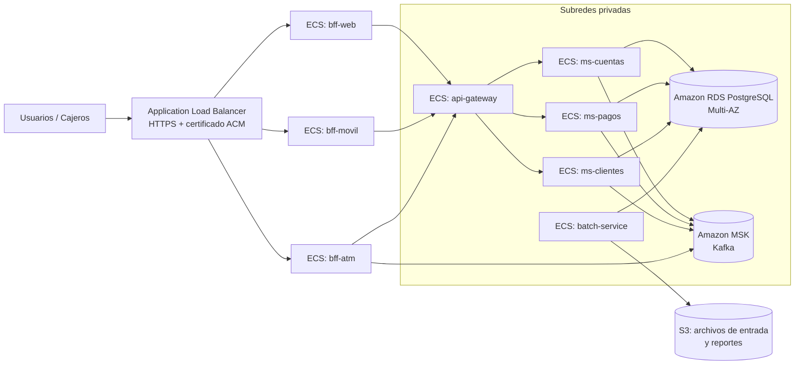

# Despliegue en la nube (AWS)

Todos los microservicios ya están preparados para la nube:

- Son imágenes Docker con un `Dockerfile` multi-etapa.
- Son *stateless*: el estado vive en PostgreSQL y Kafka.
- Toda la configuración entra por variables de entorno (`CONFIG_URL`, `EUREKA_URL`, `KAFKA_BOOTSTRAP`, `AUTH_ISSUER`, `DB_URL`, etc.).
- Tienen health checks (`/actuator/health`) para que la nube detecte y reemplace las instancias caídas.

Se describen dos opciones:

| | Opción A: EC2 + Docker Compose | Opción B: ECS Fargate + servicios administrados |
|---|---|---|
| Para | Demo, QA, evaluación | Producción |
| Complejidad | Baja (unos 20 minutos) | Media |
| Escalado | `--scale` manual en una máquina | Auto Scaling por CPU o por solicitudes, en varias zonas |
| BD / Kafka | Contenedores | Amazon RDS PostgreSQL / Amazon MSK |
| Costo aproximado | 1 × t3.xlarge ≈ USD 0,17/h | Según el uso |

---

## Opción A: EC2 con Docker Compose

### A.1 Crear la instancia

1. En la consola de AWS, ve a **EC2 → Launch instance**.
   - AMI: **Ubuntu Server 24.04 LTS**
   - Tipo: **t3.xlarge** (4 vCPU, 16 GB). Mínimo t3.large (8 GB) con una réplica por servicio.
   - Almacenamiento: 30 GB gp3
   - Key pair: crea uno o usa uno existente (`banco-xyz.pem`)
2. Crea un **Security Group** `banco-xyz-sg` con estas reglas de entrada:

| Puerto | Origen | Uso |
|---|---|---|
| 22 | Tu IP | SSH |
| 8443, 8444, 8445 | 0.0.0.0/0 | BFF web, móvil y cajeros (HTTPS) |
| 9000 | 0.0.0.0/0 | Auth server (obtener tokens) |
| 8761, 8085, 8090 | Tu IP | Eureka, Kafka UI y API batch (sólo administración) |

> El gateway (8080), los microservicios, PostgreSQL y Kafka **no se exponen**: sólo son accesibles dentro de la red Docker.

### A.2 Instalar Docker

```bash
ssh -i banco-xyz.pem ubuntu@<IP_PUBLICA>

sudo apt-get update
sudo apt-get install -y ca-certificates curl git jq
curl -fsSL https://get.docker.com | sudo sh
sudo usermod -aG docker ubuntu && newgrp docker
docker compose version
```

### A.3 Desplegar

```bash
git clone https://github.com/camiluck/banco-xyz-eft.git
cd banco-xyz-eft

# Secretos de producción: nunca usar los valores de desarrollo
cat > .env <<'EOF'
SECRET_FRONTEND_WEB=cambiar-esto-1
SECRET_FRONTEND_MOVIL=cambiar-esto-2
SECRET_CAJERO_ATM=cambiar-esto-3
EOF

docker compose up -d --build
docker compose ps            # esperar a que todos estén "healthy"
./scripts/prueba-humo.sh     # verificación de punta a punta
```

Para probar desde tu computador, reemplaza `localhost` por la IP pública:

```bash
curl -s -u frontend-web:web-secret -d grant_type=client_credentials -d scope=canal.web http://<IP_PUBLICA>:9000/oauth2/token
```

### A.4 Escalar y actualizar

```bash
docker compose up -d --scale ms-pagos=4 --scale ms-cuentas=3    # escalado horizontal
git pull && docker compose up -d --build                         # nueva versión
```

### A.5 Reinicio automático

Todos los servicios tienen `restart: unless-stopped`. Si la instancia se reinicia, Docker vuelve a levantar todo solo:

```bash
sudo systemctl enable docker
```

---

## Opción B: Amazon ECS Fargate (producción)



### B.1 Publicar las imágenes en Amazon ECR

```bash
export AWS_REGION=us-east-1
export CUENTA=$(aws sts get-caller-identity --query Account --output text)
export REGISTRO=$CUENTA.dkr.ecr.$AWS_REGION.amazonaws.com
aws ecr get-login-password | docker login --username AWS --password-stdin $REGISTRO

for m in config-server eureka-server auth-server api-gateway ms-cuentas ms-pagos ms-clientes \
         bff-web bff-movil bff-atm batch-service; do
  aws ecr create-repository --repository-name bancoxyz/$m >/dev/null 2>&1 || true
  docker build --build-arg MODULE=$m -t $REGISTRO/bancoxyz/$m:1.0 .
  docker push $REGISTRO/bancoxyz/$m:1.0
done
```

### B.2 Servicios administrados

| Recurso | Servicio AWS | Configuración |
|---|---|---|
| Red | VPC | 2 zonas de disponibilidad, subredes públicas (ALB) y privadas (servicios, BD, Kafka) |
| Base de datos | **RDS PostgreSQL 16** Multi-AZ | Crear `cuentas_db`, `pagos_db`, `clientes_db` y `batch_db` (`docker/postgres-init.sql`) |
| Mensajería | **Amazon MSK** (Kafka 3.9) | 3 brokers, 1 por zona. Variable `KAFKA_BOOTSTRAP` = *bootstrap brokers* |
| Secretos | **Secrets Manager** | Claves de BD y *client secrets* OAuth2, inyectados como variables de entorno en la *task definition* |
| Certificados | **ACM** | Certificado público para `api.bancoxyz.cl`, asociado al ALB |
| Descubrimiento | Eureka en ECS, o **ECS Service Connect / Cloud Map** | Con Cloud Map se puede prescindir de Eureka (`eureka.client.enabled=false`) |
| Logs | **CloudWatch Logs** | Driver `awslogs` en cada task |
| Métricas | **CloudWatch** / Amazon Managed Prometheus | Recolecta `/actuator/prometheus` |
| Batch | Servicio ECS con 1 tarea (API) o **EventBridge Scheduler → ECS RunTask** | Reemplaza el cron del mainframe |

### B.3 Task definition (ejemplo: ms-pagos)

```json
{
  "family": "ms-pagos",
  "requiresCompatibilities": ["FARGATE"],
  "networkMode": "awsvpc",
  "cpu": "512",
  "memory": "1024",
  "executionRoleArn": "arn:aws:iam::<CUENTA>:role/ecsTaskExecutionRole",
  "containerDefinitions": [{
    "name": "ms-pagos",
    "image": "<CUENTA>.dkr.ecr.us-east-1.amazonaws.com/bancoxyz/ms-pagos:1.0",
    "portMappings": [{ "containerPort": 8082 }],
    "environment": [
      { "name": "CONFIG_URL",      "value": "http://config-server.banco.local:8888" },
      { "name": "EUREKA_URL",      "value": "http://eureka-server.banco.local:8761/eureka" },
      { "name": "AUTH_ISSUER",     "value": "http://auth-server.banco.local:9000" },
      { "name": "KAFKA_BOOTSTRAP", "value": "b-1.bancoxyz.kafka.us-east-1.amazonaws.com:9092,b-2...:9092" },
      { "name": "DB_URL",          "value": "jdbc:postgresql://bancoxyz.xxxx.us-east-1.rds.amazonaws.com:5432/pagos_db" }
    ],
    "secrets": [
      { "name": "DB_USER",         "valueFrom": "arn:aws:secretsmanager:...:bancoxyz/db:username::" },
      { "name": "DB_PASSWORD",     "valueFrom": "arn:aws:secretsmanager:...:bancoxyz/db:password::" },
      { "name": "SECRET_MS_PAGOS", "valueFrom": "arn:aws:secretsmanager:...:bancoxyz/oauth:ms-pagos::" }
    ],
    "healthCheck": {
      "command": ["CMD-SHELL", "curl -fs http://localhost:8082/actuator/health || exit 1"],
      "interval": 15, "timeout": 5, "retries": 3, "startPeriod": 60
    },
    "logConfiguration": {
      "logDriver": "awslogs",
      "options": { "awslogs-group": "/bancoxyz/ms-pagos", "awslogs-region": "us-east-1", "awslogs-stream-prefix": "ecs" }
    }
  }]
}
```

### B.4 Escalabilidad horizontal automática

```bash
aws application-autoscaling register-scalable-target \
  --service-namespace ecs --resource-id service/banco-xyz/ms-pagos \
  --scalable-dimension ecs:service:DesiredCount --min-capacity 2 --max-capacity 10

aws application-autoscaling put-scaling-policy \
  --service-namespace ecs --resource-id service/banco-xyz/ms-pagos \
  --scalable-dimension ecs:service:DesiredCount --policy-name cpu-60 \
  --policy-type TargetTrackingScaling \
  --target-tracking-scaling-policy-configuration \
  '{"TargetValue":60.0,"PredefinedMetricSpecification":{"PredefinedMetricType":"ECSServiceAverageCPUUtilization"}}'
```

Con un mínimo de 2 tareas repartidas en 2 zonas de disponibilidad, la caída de una zona no detiene el servicio.

### B.5 HTTPS en producción

En producción el certificado lo pone el **ALB** con ACM. Los BFF pueden recibir tráfico interno con `SSL_ENABLED=false`, o mantener TLS de punta a punta con un keystore propio (`SSL_KEYSTORE`, `SSL_KEYSTORE_PASSWORD`). El keystore autofirmado del repositorio es **sólo para desarrollo**.

### B.6 Pipeline CI/CD

El workflow `.github/workflows/ci.yml` ya compila, prueba y valida con Docker Compose. Para el despliegue continuo se agrega un job que, en la rama `main`:

1. Se autentica en AWS (OIDC con `aws-actions/configure-aws-credentials`).
2. Publica las imágenes en ECR (paso B.1).
3. Actualiza cada servicio: `aws ecs update-service --cluster banco-xyz --service ms-pagos --force-new-deployment`.

ECS hace un *rolling update*: levanta las tareas nuevas y espera a que estén *healthy* antes de bajar las antiguas, así que no hay corte de servicio.

---

## Checklist de seguridad antes de producción

- [ ] Cambiar todos los *client secrets* y las claves de BD (Secrets Manager).
- [ ] Llave RSA persistente para firmar los JWT (hoy se genera al iniciar auth-server).
- [ ] Usuarios reales en auth-server (base de datos o integración con el IdP del banco).
- [ ] Certificado válido (ACM) y sólo HTTPS hacia Internet.
- [ ] Puertos de administración (Eureka, Kafka UI, batch) sólo accesibles por VPN.
- [ ] Kafka con TLS y autenticación (MSK IAM o SASL/SCRAM).
- [ ] Backups automáticos de RDS y retención de logs en CloudWatch.
