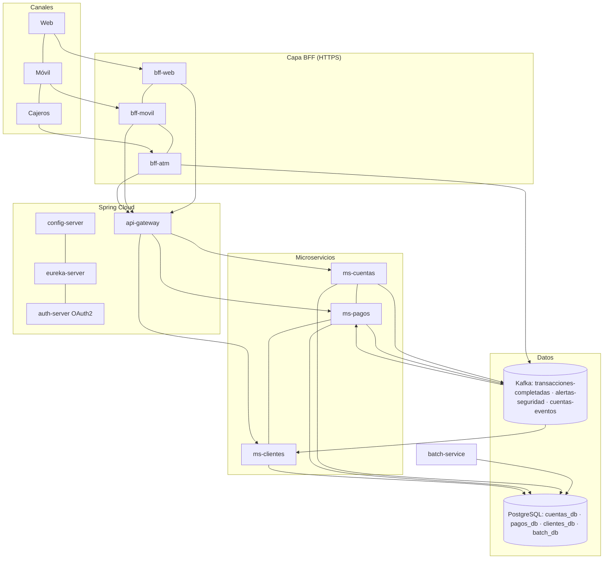
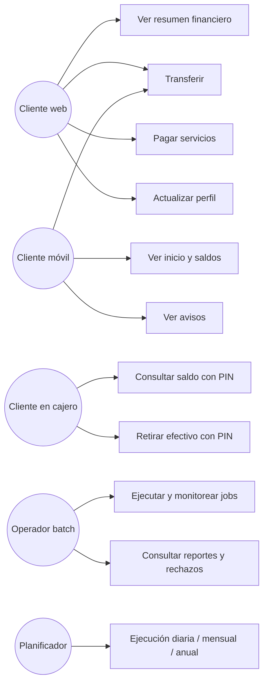
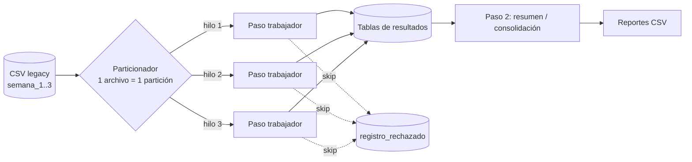

# Informe técnico: modernización del backend del Banco XYZ

> Contenido base para el informe en PDF. Copiar cada sección en la plantilla `PBY2203_EFT_S9_plantilla_PDF` del AVA. Los diagramas Mermaid se ven renderizados en GitHub; se pueden capturar como imagen desde ahí o desde https://mermaid.live.

---

## 1. Introducción

El Banco XYZ opera hace más de 30 años sobre una plataforma legacy basada en COBOL y scripts Shell en mainframe. Ese sistema procesa transacciones, genera estados de cuenta, calcula intereses y gestiona clientes. Sus limitaciones de escalabilidad, su alto costo de mantenimiento y la dificultad para integrar nuevos canales hicieron necesaria su modernización.

Este informe describe la solución desarrollada: una arquitectura de microservicios en la nube, construida con Spring Boot, Spring Cloud, Spring Batch y Apache Kafka, que reemplaza los procesos batch legacy, separa el monolito en servicios independientes y ofrece un backend optimizado para cada canal (web, móvil y cajeros automáticos).

### 1.1 Objetivos

- **General:** migrar el sistema legacy a una arquitectura moderna, escalable, resiliente y segura, desplegable en la nube.
- **Específicos:**
  1. Reescribir los 3 procesos batch en Spring Batch, con manejo avanzado de errores, paralelismo y resultados equivalentes al legacy.
  2. Implementar el patrón Backend for Frontend para 3 canales, optimizando el rendimiento y la seguridad de cada uno.
  3. Crear los microservicios de Cuentas, Pagos y Clientes con Spring Cloud, Resilience4j, OAuth2 y Kafka.
  4. Contenerizar la solución con Docker y prepararla para escalar horizontalmente en AWS.

### 1.2 Alcance

| Incluido | Fuera de alcance |
|---|---|
| 3 jobs batch, 3 BFF, 3 microservicios, config, registro, gateway, servidor OAuth2, Kafka, Docker Compose, guía AWS, pruebas automáticas y CI | Interfaces gráficas (frontends), integración con el core real, migración de datos históricos completos |

## 2. Procesos clave identificados

| # | Proceso | Problema legacy | Solución implementada |
|---|---|---|---|
| 1 | Migración de procesos batch a Spring Batch | Jobs secuenciales, sin reanudación, errores silenciosos | `batch-service`: chunks, retry, skip auditado, particionado paralelo, restart |
| 2 | División del monolito en microservicios | Un fallo afecta a todo el sistema; escalar es caro | `ms-cuentas`, `ms-pagos`, `ms-clientes`, cada uno con su BD |
| 3 | Patrón BFF | Todos los canales reciben la misma respuesta | `bff-web`, `bff-movil`, `bff-atm` |
| 4 | Seguridad distribuida (Spring Cloud Security / OAuth2) | Seguridad centralizada y perimetral | `auth-server` (JWT) y cada servicio como *resource server* |
| 5 | Mensajería asíncrona con Kafka | Integraciones síncronas y acopladas | 3 tópicos con productores y consumidores idempotentes |

## 3. Requerimientos clave del negocio

| ID | Requerimiento | Decisiones de arquitectura | Justificación |
|---|---|---|---|
| R1 | **Continuidad operativa**: un fallo parcial no debe detener al banco | Servicios y BD independientes; Circuit Breaker, Retry y fallback (Resilience4j); saga con compensación; batch con restart | Se aíslan los fallos y se evitan las cascadas. Ninguna operación queda a medias: o se completa, o se revierte, o se reintenta sola |
| R2 | **Escalabilidad con costo controlado** | Servicios stateless en Docker, Eureka + LoadBalancer, batch particionado | Se escala sólo lo que tiene carga (ej. ms-pagos a fin de mes) y en horizontal, sin hardware nuevo |
| R3 | **Seguridad e integridad de datos financieros** | OAuth2/JWT por canal (audiencia y scope), HTTPS, BCrypt para el PIN, idempotencia, bloqueo pesimista, eventos después del commit, auditoría de rechazos | Cumple la exigencia regulatoria: sin accesos cruzados entre canales, sin dobles cargos y con trazabilidad completa |

## 4. Arquitectura de la solución

### 4.1 Diagrama de arquitectura



### 4.2 Diagrama de componentes

```mermaid
flowchart LR
    subgraph ms-pagos
        PC[PagoController] --> PS[PagoService<br/>saga]
        PS --> CC[CuentasClient<br/>@Retry @CircuitBreaker]
        PS --> PR[(PagoRepository)]
        PS --> PE[PublicadorEventos]
        SCH[ReintentoPagosScheduler] --> PS
        KC[ConsumidorCuentas] --> PR
    end
    CC -- REST + JWT --> MC[ms-cuentas]
    PE -- Kafka --> T1[[transacciones-completadas]]
    T2[[cuentas-eventos]] --> KC
```

### 4.3 Casos de uso



### 4.4 Integración entre componentes

1. Cada servicio, al iniciar, obtiene su configuración del **config-server** y se registra en **Eureka**.
2. El frontend pide un token al **auth-server** con las credenciales de su canal. El token lleva `aud` = cliente del canal, el `scope` del canal y una vida corta.
3. El **BFF** valida firma, emisor, audiencia y scope del token. Luego llama al **api-gateway** con *su propio* token de servicio (`client_credentials`, scope `banco.api`). El token del usuario nunca llega a los servicios internos.
4. El **gateway** valida el token, resuelve `lb://servicio` en Eureka y balancea entre réplicas, con circuit breaker y reintentos por ruta.
5. Los **microservicios** validan nuevamente el JWT (defensa en profundidad) y ejecutan la lógica de negocio sobre su propia BD.
6. Los cambios relevantes se publican en **Kafka** después del commit. Los consumidores reaccionan en tiempo real y procesan cada mensaje una sola vez.

## 5. Parte 1: procesos batch con Spring Batch

### 5.1 Diseño común de los 3 jobs



| Requerimiento | Implementación |
|---|---|
| Jobs con pasos de leer, procesar y escribir | `FlatFileItemReader` → `ItemProcessor` (validar, normalizar, calcular) → `JdbcBatchItemWriter`, en *chunks* transaccionales de 100 registros |
| Excepciones y reintentos ante fallos temporales | `retry(TransientDataAccessException, DataAccessResourceFailureException)`, 3 intentos con backoff exponencial (0,5 s → 1 s → 2 s) |
| Datos inválidos | `PoliticaOmision`: los errores de datos se omiten (hasta 1.000 por paso) y quedan en `registro_rechazado` con archivo, línea, contenido y motivo. Cualquier otro error detiene el paso |
| Grandes volúmenes en menos tiempo | Particionado (`MultiResourcePartitioner` + `ThreadPoolTaskExecutor`): los archivos se procesan en paralelo. Las lecturas de BD usan cursor (`JdbcCursorItemReader`) |
| Políticas de finalización | Si el paso 1 falla, el job termina `FAILED` y no genera reportes incompletos. Si terminó con omisiones, el estado de salida es `COMPLETADO_CON_OMISIONES` |
| Reejecución automática ante fallos críticos | `ReejecucionAutomaticaListener`: un job `FAILED` se relanza con los mismos parámetros (restart) hasta 3 veces. Continúa desde el último commit y no repite particiones completadas |
| Integridad y consistencia | Commit atómico por chunk; reader con estado guardado; tasklets idempotentes (borran y regeneran el resumen); deduplicación por hash SHA-256 que sobrevive a reinicios |
| Resultados equivalentes al legacy | Implementación de referencia independiente (`referencia_legacy.py`) y tests automáticos que comparan los totales (tabla 5.3) |

### 5.2 Reglas de negocio por job

| Job | Reglas |
|---|---|
| Transacciones diarias | Fechas en 4 formatos normalizadas a ISO. Sin id, fecha o monto → se omite. Monto ≤ 0 o tipo distinto de débito/crédito → **anomalía** (se guarda y se reporta, pero no suma). Resumen por día: créditos, débitos, neto y anomalías |
| Intereses mensuales | Saldo obligatorio y ≥ 0; edad entre 18 y 99; tipo ahorro, préstamo o hipoteca; duplicados exactos se omiten. Interés = saldo × tasa anual / 12, redondeo HALF_UP (ahorro 3 %, préstamo 12 %, hipoteca 4,8 % anual) |
| Estados de cuenta anuales | Transacción sin tildes; monto 0 o vacío se omite; cargo negativo → valor absoluto (convención legacy, marcado "ajustado"); depósito negativo se omite; descripción vacía → "SIN DESCRIPCION"; filtro por año. Consolidado por cuenta: depósitos, retiros, compras, pagos, cargos y saldo neto |

### 5.3 Resultados (dataset semana_3, 1.000 registros por archivo)

| Job | Procesados | Anomalías | Omitidos | Resultado | ¿Igual a la referencia? |
|---|---|---|---|---|---|
| Transacciones | 789 | 397 | 211 | Créditos 244.500 / Débitos 284.900 | ✅ |
| Intereses | 340 | – | 660 | Interés total 15.440,50 | ✅ |
| Estados de cuenta | 759 | – | 241 | 20 cuentas, saldo neto −418.700 | ✅ |

## 6. Parte 2: Backend for Frontend

| | BFF Web | BFF Móvil | BFF Cajeros |
|---|---|---|---|
| Objetivo | Datos completos para interfaces ricas | Mínimo consumo de datos | Operaciones críticas seguras |
| Endpoints | `/web/clientes/{id}/resumen`, movimientos, operaciones, transferencias, pagos de servicios, perfil | `/movil/clientes/{id}/inicio`, saldo, movimientos, transferencias, avisos | `/atm/consulta-saldo`, `/atm/retiros` |
| Optimización | Llamadas en paralelo (hilos virtuales); degradación por sección | Una llamada para la pantalla de inicio, campos cortos, sin nulos, gzip, ETag/304 | Respuestas mínimas, `Cache-Control: no-store`, validación local de límites antes de llamar al core |
| Autenticación | `frontend-web`: authorization_code / client_credentials, token de 30 min | `frontend-movil`: PKCE obligatorio, token de 15 min | `cajero-atm`: sólo client_credentials, token de 2 min, más terminal registrado (`X-Terminal-Id`) y PIN |
| Autorización | `aud=frontend-web` + `SCOPE_canal.web` | `aud=frontend-movil` + `SCOPE_canal.movil` | `aud=cajero-atm` + `SCOPE_canal.atm` |
| Comunicación segura | HTTPS (TLS) + HSTS | HTTPS + HSTS | HTTPS + HSTS + Idempotency-Key obligatoria |

Los BFF son aplicaciones **independientes**: cada uno tiene su código, su configuración y su contrato propio, así que el equipo de cada frontend puede evolucionar en paralelo sin afectar a los demás ni al backend.

## 7. Parte 3: microservicios resilientes

### 7.1 Servicios

| Servicio | Funciones | Datos |
|---|---|---|
| ms-cuentas | Apertura, cierre (sólo con saldo 0), bloqueo y activación, saldo, movimientos **idempotentes**, validación de PIN con bloqueo tras 3 intentos | `cuentas_db`: cuentas, movimientos (Flyway) |
| ms-pagos | Transferencias, pagos de servicios, depósitos y retiros como **saga** (débito → crédito → compensación); reintento planificado de pendientes; Idempotency-Key | `pagos_db`: pagos |
| ms-clientes | Registro con validación de RUT (módulo 11), consulta, actualización, baja lógica, notificaciones | `clientes_db`: clientes, notificaciones |

### 7.2 Spring Cloud

| Requerimiento | Implementación |
|---|---|
| Spring Cloud Config | `config-server` (perfil native) con `config-repo/`: configuración compartida y por servicio, sobreescribible con variables de entorno |
| Eureka | `eureka-server`; cada instancia se registra con un id único, así varias réplicas conviven |
| Balanceo y enrutamiento | `api-gateway` (Spring Cloud Gateway): rutas `/api/cuentas/**`, `/api/pagos/**` y `/api/clientes/**` hacia `lb://…`. Clientes REST `@LoadBalanced` en BFF y ms-pagos |
| OAuth2 con Spring Security | `auth-server` (Spring Authorization Server) emite JWT RS256. Gateway, microservicios, BFF y batch son *resource servers* que exigen el scope correspondiente |

### 7.3 Resiliencia (Resilience4j)

| Dónde | Mecanismo | Comportamiento alternativo |
|---|---|---|
| api-gateway | Circuit breaker por ruta (50 % de fallas en 10 llamadas → abierto 15 s), time limiter de 5 s, retry en GET | `/fallback/{servicio}` responde 503 JSON inmediato |
| ms-pagos → ms-cuentas | `@Retry` (3 intentos, backoff exponencial) + `@CircuitBreaker`; los 4xx de negocio no cuentan como falla | El pago queda `PENDIENTE` y lo retoma el planificador; si el destino rechaza, se compensa el débito |
| BFF → gateway | Retry + Circuit breaker por servicio (clientes, cuentas, pagos) | Web: secciones opcionales vacías y listadas en `seccionesNoDisponibles`. Móvil: `datosParciales: true`. ATM: el comprobante se emite aunque el saldo informativo falle |
| Kafka (consumo) | `DefaultErrorHandler`: 3 reintentos, luego Dead Letter Topic (`.DLT`) | El mensaje fallido no bloquea los siguientes |

### 7.4 Eventos Kafka

| Tópico | Productor | Consumidor | Uso |
|---|---|---|---|
| `transacciones-completadas` | ms-pagos | ms-clientes | Notificar al cliente de origen y de destino |
| `alertas-seguridad` | ms-cuentas (PIN bloqueado), ms-pagos (monto inusual), bff-atm (terminal no autorizado, PIN incorrecto) | ms-clientes | Registrar la alerta y avisar al cliente |
| `cuentas-eventos` | ms-cuentas (apertura, cierre, bloqueo, activación) | ms-clientes (contador de cuentas), ms-pagos (rechaza los pagos pendientes desde cuentas cerradas o bloqueadas) | Consistencia eventual entre servicios |

Cada tópico tiene 3 particiones, y la clave del mensaje (cuenta o referencia) garantiza el orden por entidad. El productor es idempotente (`acks=all`). Los consumidores son idempotentes: guardan `tópico-partición-offset`.

### 7.5 Consistencia de datos en un entorno distribuido

- **Database per service**: ningún servicio accede a la BD de otro.
- **Saga orquestada** en ms-pagos, con estado persistido en cada paso y transacción compensatoria.
- **Idempotencia** en todos los puntos de reintento: referencia única por movimiento (`-D`, `-C`, `-R`), `Idempotency-Key` en los pagos y offset procesado en los consumidores.
- **Bloqueo pesimista** (`SELECT … FOR UPDATE`) del saldo y bloqueo optimista (`@Version`) entre réplicas.
- **Eventos después del commit** (`@TransactionalEventListener(AFTER_COMMIT)`): nunca se publica algo que no quedó guardado.

### 7.6 Monitoreo

Spring Boot Actuator (`health`, `metrics`, `prometheus`) en todos los servicios, health checks de Docker, trazabilidad distribuida con Micrometer Tracing (el `traceId` viaja entre servicios y aparece en cada log) y Kafka UI para inspeccionar tópicos y consumidores.

## 8. Despliegue y escalabilidad

- **Docker**: un `Dockerfile` multi-etapa genérico (JRE 21, usuario no root) y un `docker-compose.yml` con 16 contenedores (13 servicios + PostgreSQL, Kafka y Kafka UI), health checks, límites de memoria y orden de arranque.
- **Escalabilidad horizontal**: ms-cuentas y ms-pagos arrancan con 2 réplicas (`deploy.replicas`) y se pueden escalar con `--scale`. Eureka y el balanceador incorporan las nuevas instancias sin reconfigurar nada.
- **AWS**: guía en `despliegue.md` con dos opciones: EC2 + Compose (demo) y ECS Fargate + RDS + MSK + ALB/ACM + Auto Scaling (producción).
- **CI**: GitHub Actions compila, ejecuta las pruebas, construye las imágenes, levanta el sistema completo y corre la prueba de punta a punta.

## 9. Pruebas

| Tipo | Cobertura |
|---|---|
| Unitarias / integración (`mvn verify`) | Validación de RUT y fechas; seguridad 401/403 por canal; idempotencia; saldo insuficiente; bloqueo de PIN; saga (éxito, rechazo, compensación, servicio caído, Idempotency-Key); degradación en los BFF; consumidor Kafka idempotente; equivalencia batch; retry; reejecución automática |
| Punta a punta (`scripts/prueba-humo.sh`) | Registro de réplicas en Eureka, tokens por canal, audiencia cruzada rechazada, transferencias, ETag/304, cajeros (terminal, PIN, idempotencia), notificación vía Kafka, caída y recuperación de ms-clientes, 3 jobs batch y falla simulada |

## 10. Comparación con el sistema legacy

| Aspecto | Legacy | Nuevo sistema | Mejora |
|---|---|---|---|
| Escalabilidad | Vertical | Horizontal por servicio | Se escala sólo lo necesario |
| Tolerancia a fallos | Punto único de falla | Aislamiento + circuit breaker + saga | Fallas parciales sin caída total |
| Batch | Secuencial, se re-ejecuta completo | Paralelo, restart desde el último commit | Menos tiempo y sin reprocesar |
| Calidad de datos | Errores silenciosos | 100 % de los rechazos auditados con motivo | Trazabilidad para auditoría |
| Seguridad | Perimetral | Zero-trust: JWT validado en cada servicio, por canal | Menor superficie de ataque |
| Canales | Una API para todos | BFF por canal | Respuestas más livianas en móvil |
| Integración | Síncrona | Eventos en tiempo real | Desacoplamiento |
| Operación | Ventanas de mantenimiento | Contenedores, CI, rolling updates | Despliegues sin corte |

## 11. Desafíos y soluciones

| Desafío | Solución |
|---|---|
| Datos legacy con errores (4 formatos de fecha, montos vacíos o negativos, duplicados, edades imposibles) | Lectura de todo como texto; validación y normalización en el processor; distinción entre registros *corregibles*, *anomalías* (se guardan marcadas) e *inválidos* (se omiten y se auditan) |
| Cómo demostrar la equivalencia con el legacy sin acceso al COBOL | Implementación de referencia independiente en Python y tests que comparan totales |
| Duplicados detectados de forma confiable aunque el job se reinicie | Hash SHA-256 del registro, recargado desde la BD en `beforeStep` |
| Transferencias entre dos servicios sin transacción distribuida | Saga con estado persistido, movimientos idempotentes y compensación |
| El emisor (`iss`) del token difiere entre localhost y la red Docker | Emisor fijo en el auth-server y validación por `jwk-set-uri` |
| Varias réplicas compitiendo por el mismo saldo o el mismo pago pendiente | Bloqueo pesimista en ms-cuentas y bloqueo optimista en ms-pagos |
| Probar la resiliencia de forma repetible | Parámetros de simulación de fallos en batch y detención controlada de servicios en la prueba de punta a punta |

## 12. Propuestas de mejora y próximos pasos

1. **Patrón Outbox** (o Debezium CDC) para garantizar la publicación de eventos aunque Kafka esté caído en el momento del commit.
2. **Llave de firma persistente y rotación** (AWS KMS) e integración con un IdP corporativo (Keycloak o Cognito) con MFA para clientes.
3. **Rate limiting** por cliente y por terminal en el gateway (Redis), como protección ante fuerza bruta.
4. **Observabilidad completa**: Grafana + Prometheus + Tempo/Zipkin con dashboards y alertas (SLO).
5. **Batch remoto**: *remote partitioning* sobre Kafka para repartir particiones entre varias instancias, y lectura de archivos desde S3.
6. **Kubernetes (EKS)** con Helm y HPA si la cantidad de servicios crece.
7. **Pruebas de contrato** (Spring Cloud Contract) entre BFF y microservicios, y pruebas de carga (Gatling) para dimensionar el auto scaling.

## 13. Conclusiones

La solución cumple los requerimientos de las tres partes del caso:

- Los procesos batch se migraron con resultados verificablemente equivalentes, procesamiento paralelo y recuperación automática.
- Cada canal tiene un BFF independiente, optimizado y con seguridad propia.
- El monolito se dividió en microservicios resilientes, seguros y comunicados por eventos.

Toda la solución está contenerizada, probada de forma automática y lista para desplegarse y escalar en AWS.
