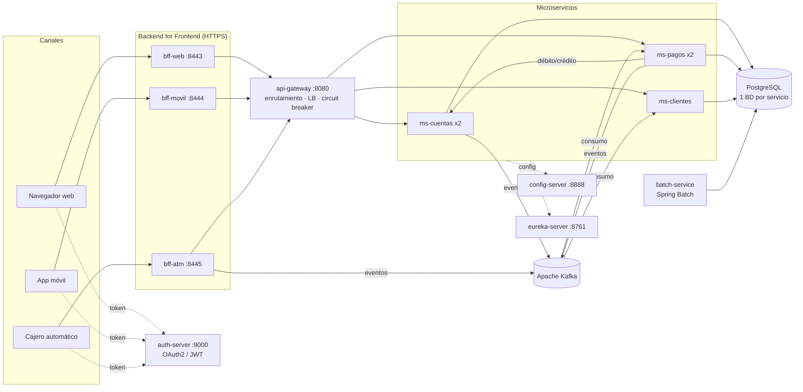
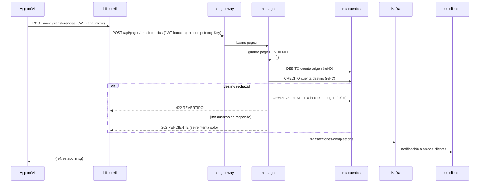

# Banco XYZ: modernización del backend legacy

**Evaluación Final Transversal · Desarrollo Backend III (PBY2203)**

**Código fuente:** https://github.com/camiluck/banco-xyz-eft

Este proyecto migra el sistema bancario legacy del Banco XYZ (COBOL y scripts Shell en mainframe) a una **arquitectura de microservicios en la nube** construida con **Spring Boot 3.5, Spring Cloud 2025, Spring Batch 5, Apache Kafka, Resilience4j y Docker**.

| Documento | Contenido |
|---|---|
| [`readme.md`](readme.md) | Visión general, arquitectura, decisiones y código fuente (este archivo) |
| [`instrucciones.md`](instrucciones.md) | Paso a paso para ejecutar y probar cada componente |
| [`despliegue.md`](despliegue.md) | Despliegue en la nube (AWS) |
| [`docs/informe-tecnico.md`](docs/informe-tecnico.md) | Contenido del informe técnico (base para el PDF) |

---

## 1. Procesos clave de la migración

| # | Proceso | Qué resuelve del legacy | Dónde está |
|---|---|---|---|
| 1 | **Migración de procesos batch a Spring Batch** | Los jobs COBOL nocturnos no toleran fallos, no se pueden reanudar y son secuenciales | `batch-service` |
| 2 | **División del monolito en microservicios** | Un error en un módulo tumbaba todo el sistema, y escalar exigía escalar todo | `ms-cuentas`, `ms-pagos`, `ms-clientes` |
| 3 | **Implementación del patrón BFF** | Web, móvil y cajeros recibían la misma respuesta pesada del monolito | `bff-web`, `bff-movil`, `bff-atm` |
| 4 | **Seguridad distribuida con Spring Cloud Security / OAuth2** | La seguridad estaba centralizada y era perimetral | `auth-server` + todos los servicios como *resource servers* |
| 5 | **Mensajería asíncrona con Apache Kafka** | Las integraciones eran síncronas y estaban acopladas | Tópicos `transacciones-completadas`, `alertas-seguridad` y `cuentas-eventos` |

## 2. Requerimientos clave del negocio y decisiones de arquitectura

| Requerimiento del negocio | Decisión | Justificación |
|---|---|---|
| **R1. Disponibilidad y tolerancia a fallos.** Un problema en un módulo no puede detener la operación del banco. | Microservicios independientes, cada uno con su propia BD (*database per service*). Resilience4j (Circuit Breaker, Retry y *fallback*) en el gateway, en los BFF y en ms-pagos. Saga con compensación en los pagos. | Si ms-clientes cae, igual se puede transferir y retirar. El circuit breaker evita fallos en cascada y los timeouts acumulados. El pago queda `PENDIENTE` y se reintenta solo, sin perder dinero. |
| **R2. Escalabilidad y costos.** Hay que soportar picos (fin de mes, aguinaldos) sin pagar un mainframe sobredimensionado. | Servicios *stateless* en contenedores Docker, registro dinámico en Eureka, balanceo `lb://` con Spring Cloud LoadBalancer, procesos batch particionados en paralelo. | Se agregan réplicas con `docker compose up --scale ms-pagos=4` o con más tareas en AWS ECS, sin cambiar código. Se paga sólo por la capacidad usada. |
| **R3. Seguridad e integridad de los datos financieros.** El banco está regulado: no se aceptan accesos indebidos ni movimientos duplicados o perdidos. | OAuth2/JWT con un cliente y una audiencia por canal, HTTPS en los BFF, PIN con BCrypt y bloqueo tras 3 intentos. Idempotencia (`Idempotency-Key` y referencia única por movimiento), bloqueo pesimista del saldo y eventos publicados sólo después del *commit*. | Un token web no sirve en la app móvil ni en un cajero. Un reintento por red nunca descuenta dos veces. Cada operación queda auditada (tabla `registro_rechazado` y eventos Kafka). |

## 3. Arquitectura



### Módulos

| Módulo | Puerto | Responsabilidad |
|---|---|---|
| `config-server` | 8888 | Configuración centralizada (Spring Cloud Config, carpeta `config-repo`) |
| `eureka-server` | 8761 | Registro y descubrimiento dinámico de servicios |
| `auth-server` | 9000 | Servidor OAuth2 (Spring Authorization Server). Emite JWT por canal y por servicio |
| `api-gateway` | 8080 | Spring Cloud Gateway: enrutamiento, balanceo de carga, circuit breaker y reintentos |
| `ms-cuentas` | 8081 | Apertura, cierre, mantenimiento, saldos, movimientos idempotentes y PIN |
| `ms-pagos` | 8082 | Transferencias, pagos de servicios, depósitos y retiros (saga + compensación) |
| `ms-clientes` | 8083 | Datos personales, perfiles (con validación de RUT) y notificaciones desde Kafka |
| `bff-web` | 8443 | Dashboard completo, armado con llamadas en paralelo y degradación elegante |
| `bff-movil` | 8444 | Respuestas mínimas con gzip, ETag (304) y datos enmascarados |
| `bff-atm` | 8445 | Saldo y retiro con PIN, terminal autorizado, límites y `no-store` |
| `batch-service` | 8090 | Los 3 procesos batch migrados y su API de operación |

### Flujo de una transferencia (saga)



## 4. Procesos batch (Parte 1)

| Job | Lee | Hace | Escribe |
|---|---|---|---|
| `transaccionesDiariasJob` | `movimientos_financieros_diarios.csv` | Normaliza fechas (4 formatos), detecta anomalías (monto ≤ 0, tipo inválido) y omite los registros ilegibles | `transaccion_diaria`, `resumen_transacciones_diario`, reportes CSV |
| `interesesMensualesJob` | `intereses_trimestrales.csv` | Valida saldo, edad (18 a 99) y tipo, elimina duplicados exactos y calcula el interés mensual por producto | `interes_mensual`, reportes CSV |
| `estadosCuentaAnualesJob` | `estados_financieros_anuales.csv` | Limpia (tildes, signo de los cargos, descripción vacía), filtra el año y consolida por cuenta | `movimiento_anual`, `estado_cuenta_anual`, CSV |

**Tolerancia a fallos:**
- Procesamiento por *chunks* transaccionales.
- *Retry* con backoff exponencial ante errores transitorios de BD.
- *Skip* auditado de registros inválidos.
- Particionado: cada archivo es una partición y se procesan en paralelo.
- Estado de salida `COMPLETADO_CON_OMISIONES`.
- Reejecución automática (*restart* desde el último *commit*) cuando falla un job.

**Equivalencia con el legacy.** `herramientas/referencia_legacy.py` implementa las mismas reglas en Python, de forma independiente. Los tests `EquivalenciaLegacyTests` comprueban que Spring Batch obtiene exactamente los mismos resultados:

| Dataset `semana_3` | Referencia legacy | Spring Batch |
|---|---|---|
| Transacciones: guardadas / anomalías / omitidas | 789 / 397 / 211 | 789 / 397 / 211 |
| Total créditos / débitos válidos | 244.500 / 284.900 | 244.500 / 284.900 |
| Intereses: cuentas calculadas / omitidas / interés total | 340 / 660 / 15.440,50 | 340 / 660 / 15.440,50 |
| Estados: movimientos / omitidos / cuentas / saldo neto | 759 / 241 / 20 / −418.700 | 759 / 241 / 20 / −418.700 |

## 5. Comparación con el sistema legacy

| Aspecto | Legacy (COBOL + Shell, mainframe) | Nueva arquitectura |
|---|---|---|
| Escalabilidad | Vertical (hardware más grande) | Horizontal: réplicas en contenedores y particiones batch en paralelo |
| Fallos | Un módulo caído detiene el sistema | Aislamiento por servicio, circuit breaker, fallback y reintentos |
| Batch | Si falla, se vuelve a correr desde cero | Restart desde el último *commit*, retry automático y skip auditado |
| Calidad de datos | Errores silenciosos | Cada registro rechazado queda con línea, contenido y motivo |
| Seguridad | Centralizada y perimetral | OAuth2/JWT en cada servicio, token por canal, HTTPS y PIN con BCrypt |
| Canales | Misma respuesta para todos | Un BFF por canal, con su propia optimización y seguridad |
| Integración | Síncrona y acoplada | Eventos Kafka en tiempo real, consumidores idempotentes y DLT |
| Despliegue | Ventanas de mantenimiento | Contenedores Docker, CI en GitHub Actions y despliegue en AWS |
| Monitoreo | Logs dispersos | Actuator, Prometheus, traceId en cada log y Kafka UI |

## 6. Tecnologías

Java 21 · Spring Boot 3.5 · Spring Cloud 2025.0 (Config, Netflix Eureka, Gateway, LoadBalancer, Circuit Breaker) · Spring Security OAuth2 (Authorization Server y Resource Server) · Spring Batch 5 · Spring Data JPA + Flyway · Resilience4j · Apache Kafka 3.9 · PostgreSQL 16 / H2 · Micrometer (Prometheus y tracing) · Docker y Docker Compose · GitHub Actions.

## 7. Estructura del repositorio

```
├── config-server/      config-repo/ con la configuración de todos los servicios
├── eureka-server/
├── auth-server/
├── api-gateway/
├── ms-cuentas/         dominio, servicio, web, eventos, migraciones Flyway
├── ms-pagos/
├── ms-clientes/
├── bff-web/  bff-movil/  bff-atm/
├── batch-service/      data/ (CSV legacy), jobs, SQL de resultados
├── herramientas/       referencia_legacy.py (verificación de equivalencia)
├── scripts/            prueba-humo.sh (prueba de punta a punta)
├── docker/             init de PostgreSQL
├── docker-compose.yml  Dockerfile  .github/workflows/ci.yml
└── readme.md  instrucciones.md  despliegue.md  docs/
```

## 8. Calidad

- **Pruebas automáticas** en todos los módulos (`mvn verify`): seguridad por canal, idempotencia, saldo insuficiente, bloqueo de PIN, la saga (éxito, rechazo, compensación y servicio caído), degradación de los BFF, equivalencia batch, retry y reejecución automática.
- **Prueba de punta a punta** (`scripts/prueba-humo.sh`) sobre el sistema completo en Docker. Incluye detener un microservicio para comprobar la resiliencia.
- **CI** en GitHub Actions: cada *push* compila, ejecuta las pruebas, levanta todo con Docker Compose y corre la prueba de punta a punta.

> Datos de origen: [KariVillagran/fin_legacy_data](https://github.com/KariVillagran/fin_legacy_data) (copiados en `batch-service/data`).
